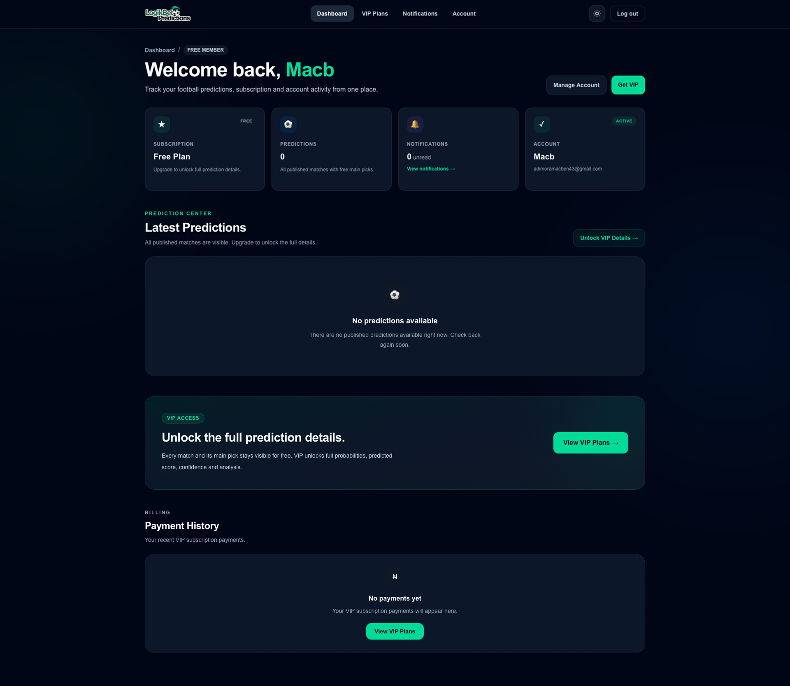
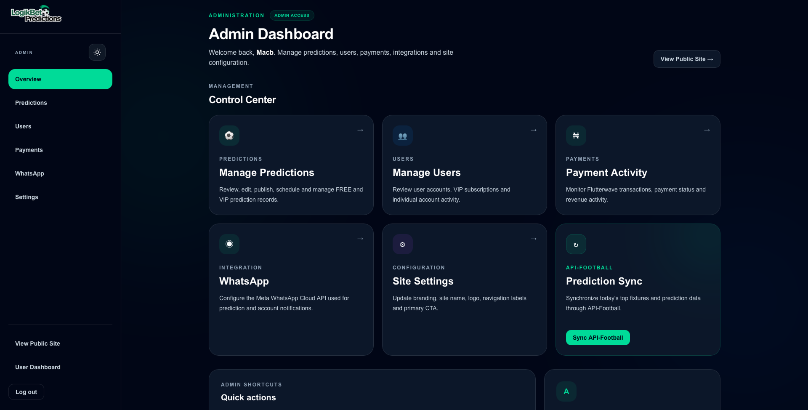

# ⚽ LogikBetPrediction

A production-focused football prediction platform that provides daily match predictions, premium VIP tips, user subscriptions, account management, and an administrative system for managing predictions and users.

🌐 **Live Application:** [View LogikBetPrediction](https://logik-bet-prediction-z32b.vercel.app)

> **Note:** This is a public showcase repository. The production source code is maintained in a private repository.

---

## 🚀 About the Project

LogikBetPrediction is a full-stack football prediction platform I designed and developed to go beyond a simple prediction website.

The platform combines football data APIs, automated fixture synchronization, authentication, subscription management, prediction publishing, notifications, and a complete administrative dashboard.

The goal was to build a real production-style application with separate experiences for visitors, registered users, VIP subscribers, and administrators.

---

## ✨ Key Features

### Football Predictions

* Daily football predictions
* Match probability data
* Free and VIP predictions
* Automated fixture imports
* Prediction publishing system
* Historical fixture cleanup

### User System

* Registration and login
* Email verification
* Password recovery
* Account management
* User dashboard
* Subscription status and history

### VIP & Subscription System

* Free and premium prediction categories
* Weekly and monthly subscription architecture
* Payment tracking
* VIP access control

### Admin Dashboard

* Platform overview
* Prediction management
* User management
* Payment management
* Site settings
* Integration management
* Administrative activity tracking

### Notifications

* Email notification architecture
* User notification preferences
* WhatsApp integration interface

### UI / UX

* Fully responsive interface
* Mobile navigation
* Dark/light theme
* User and administrator dashboards
* Modern component-based interface

---

## 🛠 Tech Stack

**Frontend**

* Next.js
* React
* TypeScript
* Tailwind CSS

**Backend**

* Next.js Server/API Routes
* Node.js
* Prisma ORM

**Database**

* PostgreSQL
* Neon

**Authentication**

* NextAuth / Auth.js
* Credentials authentication
* bcrypt

**Football Data**

* API-Football
* PlayerElo integration

**Infrastructure**

* Vercel
* Neon PostgreSQL
* Git & GitHub

Additional integrations include email notifications, caching, file storage, and payment infrastructure.

---

## 🏗 Architecture

The application uses a full-stack Next.js architecture.

```text
                    ┌────────────────────┐
                    │       Users        │
                    └─────────┬──────────┘
                              │
                              ▼
                    ┌────────────────────┐
                    │   Next.js / React  │
                    │     Frontend       │
                    └─────────┬──────────┘
                              │
                 ┌────────────┴────────────┐
                 ▼                         ▼
        ┌─────────────────┐       ┌─────────────────┐
        │ Authentication  │       │ Server / APIs   │
        │    Auth.js      │       │    Next.js      │
        └────────┬────────┘       └────────┬────────┘
                 │                         │
                 └────────────┬────────────┘
                              ▼
                     ┌─────────────────┐
                     │     Prisma      │
                     │       ORM       │
                     └────────┬────────┘
                              ▼
                     ┌─────────────────┐
                     │   PostgreSQL    │
                     │      Neon       │
                     └─────────────────┘

External Services
       │
       ├── API-Football
       ├── PlayerElo
       ├── Email Service
       └── Payment Infrastructure
```

---

## 🧠 Engineering Challenges

### Automated Football Data

The platform integrates external football data providers and transforms incoming fixture information into records that can be used by the prediction system.

The synchronization process handles:

* Future fixture filtering
* Competition filtering
* Duplicate prevention
* Database updates
* Missing probability data
* Historical fixture cleanup
* Provider failures and incomplete responses

### Authentication & Authorization

The application separates access between:

* Visitors
* Registered users
* VIP subscribers
* Administrators

Protected routes and server-side authorization prevent unauthorized access to administrative and subscriber functionality.

### Database Design

The PostgreSQL database models relationships between:

* Users
* Accounts
* Sessions
* Fixtures
* Predictions
* Prediction views
* Subscriptions
* Payments
* Notifications
* Notification preferences
* Administrative actions

### Production Reliability

External APIs can return incomplete records, rate limits, unavailable fixtures, or unexpected responses.

The synchronization system therefore includes validation and diagnostics rather than assuming every provider response is usable.

---

## 📸 Screenshots

### Homepage


### User Dashboard



### Admin Dashboard




---

## 🔒 Source Code

The production source code for LogikBetPrediction is intentionally maintained in a **private GitHub repository**.

This public repository exists to document the project's architecture, functionality, engineering decisions, and development work without distributing the proprietary implementation.

Source access may be provided privately for technical review when appropriate.

---

## 👨‍💻 Developer

**Macben Adimora**

Full-Stack / WordPress Developer

Portfolio: [mackvngtech.com](https://www.mackvngtech.com)

GitHub: [Macadimora](https://github.com/Macadimora)

LinkedIn: [Macben Adimora](https://linkedin.com/in/macben-adimora-884773163)
